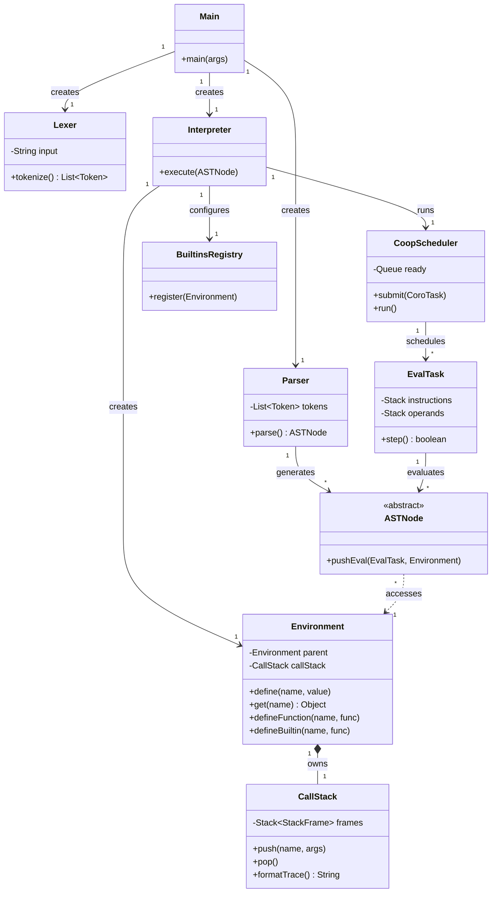

# Python Interpreter in Java

A lightweight Java-based interpreter that parses and executes a simple Python-like language. This project demonstrates how to build core interpreter components including lexical analysis, parsing, abstract syntax tree (AST) construction, and evaluation.


---

## 🚀 Features

- **Lexer**: Tokenizes input source code into meaningful symbols.
- **Parser**: Constructs an Abstract Syntax Tree (AST) from tokens.
- **AST**: Represents the syntactic structure of the code.
- **Interpreter**: Evaluates the AST within an environment that maintains variable bindings.
- **Environment**: Stores and manages variable scopes and values.
- **Call Stack**: Safe execution, recursion limiting, and error backtracing.
- **Built-in Functions**: Standard functions like `str()`, `len()`, `abs()`, `spawn()`, etc.
- **Cooperative Multitasking**: Concurrent execution using an implicit state-machine scheduler without OS thread-locking.
- **Input Support**: Reads source code from `input.txt` for interpretation.

---

## 📁 File Structure

- `Lexer.java`: Lexical analyzer for token generation.
- `Parser.java`: Parses tokens into an AST.
- `AST.java`: Defines node types of the AST.
- `Interpreter.java`: Core framework linking scripts to the environment and scheduler.
- `CoopScheduler.java`: Manages the concurrent execution of multiple spawned tasks.
- `EvalTask.java`: A cooperative coroutine acting as a task representing state-machine instructions.
- `Environment.java`: Manages variable bindings.
- `CallStack.java`: Tracks active stack frames and provides stack traces.
- `BuiltinsRegistry.java`: Registration of standard system functions.
- `Token.java`: Token definitions and types.
- `Main.java`: Entry point of the interpreter.
- `input.txt`: Input file containing the source code to interpret.

---

## 🧠 Syntax Guide

### 🧮 Variable Declaration

```plaintext
let <identifier> = <expression>
```

**Example:**
```plaintext
let x = 5
let name = "John"
```

---

### ➕ Arithmetic Operations

**Supported Operators:**
- `+` (Addition)
- `-` (Subtraction)
- `*` (Multiplication)
- `/` (Division)

**Example:**
```plaintext
let sum = 10 + 20
let product = x * 5
let result = (x + y) * 2
```

---

### 🖨️ Print Statement

```plaintext
print(<expression>)
```

**Example:**
```plaintext
print(x)
print("Hello, World!")
```

---

### 🧠 Expressions

Can include:
- Integers: `10`, `-5`
- Strings: `"hello"`
- Identifiers: `x`, `y`
- Compound expressions: `x + y * 2`

---

### 📂 Order of Operations

Standard precedence:
1. Parentheses `()`
2. Multiplication / Division `* /`
3. Addition / Subtraction `+ -`

**Example:**
```plaintext
let result = (2 + 3) * 4  # result = 20
```

---

### 🧵 Concurrency & Multitasking

The interpreter features a custom cooperative scheduler that manages multiple parallel tasks. Instead of relying on blocking JVM threads, code evaluation uses a Continuation-Passing Style (CPS) state machine, allowing the language to context switch perfectly between every single atomic AST operation.

**Supported Built-ins:**
- `spawn("functionName", arg1, ...)`: Spawns a new background task executing the target function alongside the main program.
- `yield()`: Explicitly yields execution to other tasks (though the scheduler naturally yields on every single instruction out of the box).

**Example:**
```plaintext
function taskA(limit):
    let i = 0
    while (i < limit):
        print("Task A step " + str(i))
        i = i + 1

spawn("taskA", 3)
```

---

### 📝 Sample Program

```plaintext
let x = 10
let y = 20
let sum = x + y
print("Sum of x and y:")
print(sum)
```

**Output:**
```plaintext
Sum of x and y:
30
```
## ⚡ Performance Benchmark

We compared integer counting and recursive function invocations (`factorial(10)` run 100,000 times) against established engines.

| Engine / Implementation  | Simple Loop (V1) | Factorial Recursion (100k) |
|--------------------------|------------------|----------------------------|
| **Native Java loop**     | ~50–150 ms       | ~23 ms                     |
| **Python 3**             | ~200–600 ms      | ~141 ms                    |
| **Node.js (JS)**         | ~150–500 ms      | ~152 ms                    |
| **JavaInterpreter**      | ~371 ms ✅        | ~891 ms ✅                  |


---
## 🛠️ Getting Started

### Prerequisites

- Java Development Kit (JDK) 8 or higher

### Compile and Run

```bash
javac *.java
java Main
```

Make sure to edit `input.txt` with your program before running.

---

## 🏗️ Architecture



---

## 🗺️ Roadmap

- [x] **Conditionals**: `if`, `else`, and comparison operators
- [x] **Loops**: `while`, `for`, and control flow
- [x] **Functions**: Definition and calls with parameters
- [x] **Call Stack**: Stack traces and recursion limits
- [x] **Boolean Logic**: `true`, `false`, `&&`, `||`, `!`
- [x] **Concurrency**: Yield-based cooperative scheduler natively running atomic CPS nodes
- [ ] **Comments**: Ignoring lines with `//`
- [ ] **Arrays and Objects**: Composite data structures


---

## 🤝 Contributing

Pull requests and suggestions are welcome. Fork the repo and open an issue or PR.

---

## 📜 License

This project is licensed under the [MIT License](LICENSE).

---

## 👤 Author
**[Advait Sankhe](https://github.com/AdvaitSan)**

